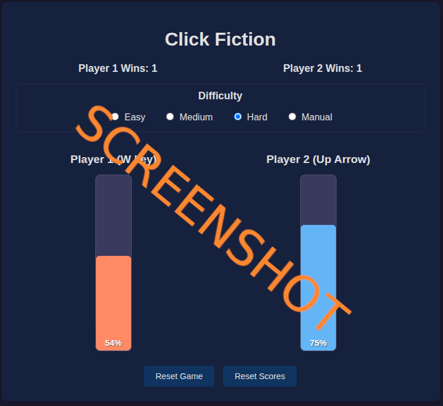

# js_clickfiction

## Play it now: https://pemmyz.github.io/js_clickfiction/

# 🎮 Click Fiction

A fast-paced 2-player reflex game built with HTML, CSS, and JavaScript. Press your key rapidly to fill your power bar, and drain your opponent's chances of winning! First one to reach 100% wins!

🕹️ **Player 1** uses the `W` key  
🕹️ **Player 2** uses the `↑ Up Arrow` key  

---

## 🧠 Gameplay

- Both players race to fill their vertical progress bars by rapidly pressing their assigned keys.
- The bar drains automatically, so consistent effort is key!
- First to reach 100% wins the round.
- Winner is announced, scores are tracked, and a new round begins automatically.

---

## ⚙️ Features

- 🔄 **Auto-Reset**: Game restarts after 3 seconds post-victory.
- 🌗 **Light/Dark Mode Toggle**: Switch themes with the ☀️ / 🌙 button.
- 🎚️ **Difficulty Settings**:
  - Easy
  - Medium (default)
  - Hard
  - Manual (adjust press power and drain speed manually)
- 🔢 **Score Tracker**: Win counters for both players.
- 🧪 **Smooth animation** and responsive UI.

---

## 🛠️ Manual Settings (under "Manual" difficulty)

- **Press Power**: Determines how much each key press increases the bar.
- **Drain Speed**: How quickly the bar depletes over time.

---

## 🧾 Controls

| Action            | Player 1       | Player 2     |
|------------------|----------------|--------------|
| Increase Bar     | `W` key        | `↑ Up Arrow` |
| Toggle Theme     | ☀️ / 🌙 button  | (Top-right)  |
| Reset Game       | Reset button   |              |
| Reset Scores     | Reset Scores   |              |

---

